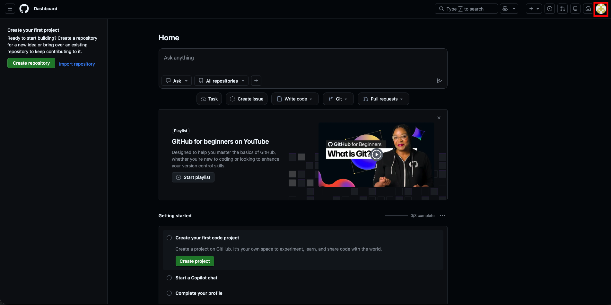
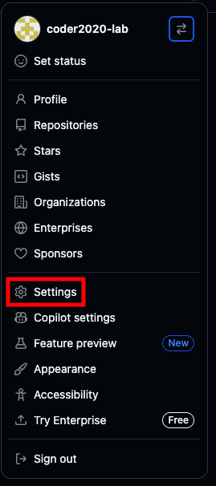
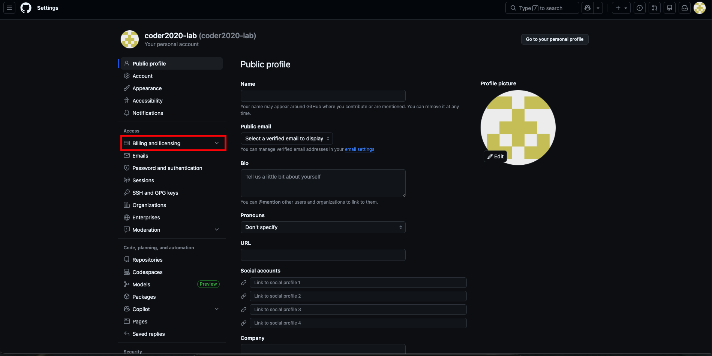
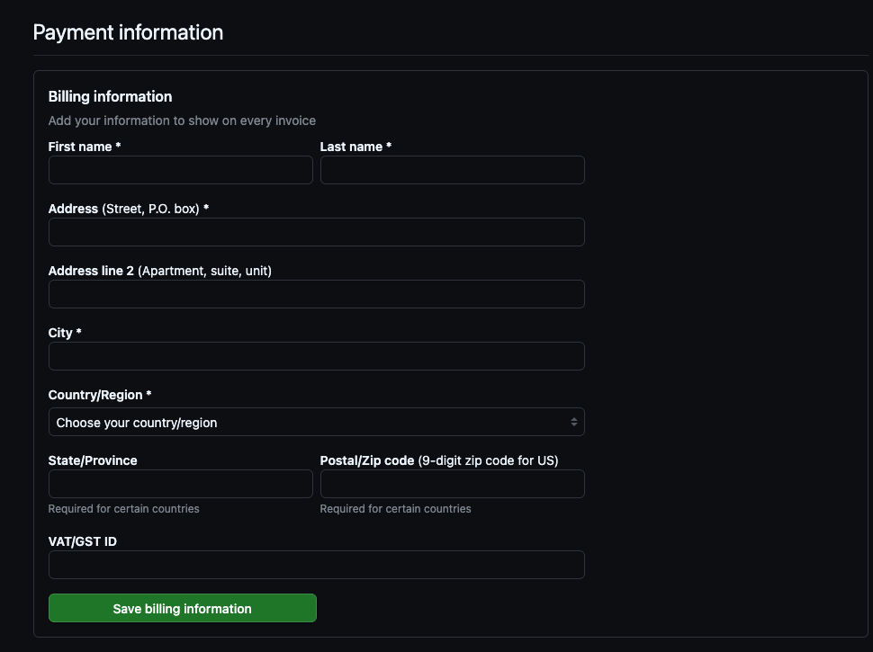
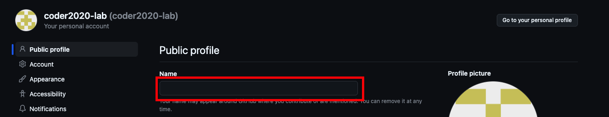
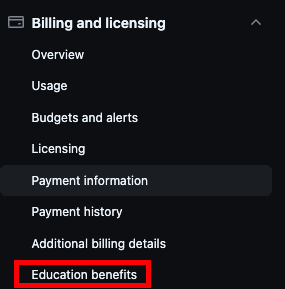
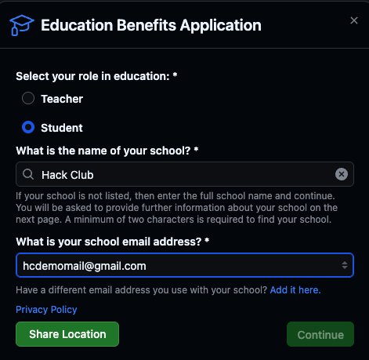
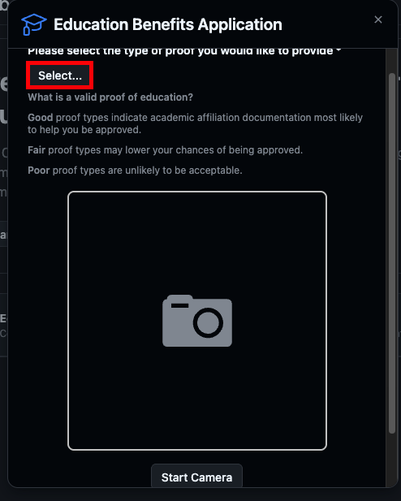
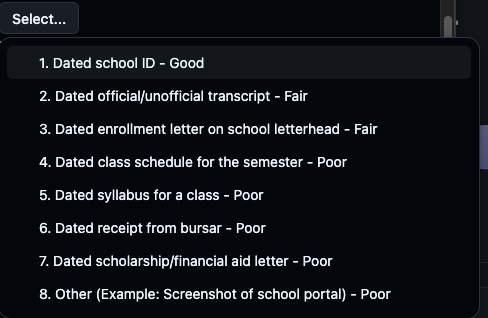
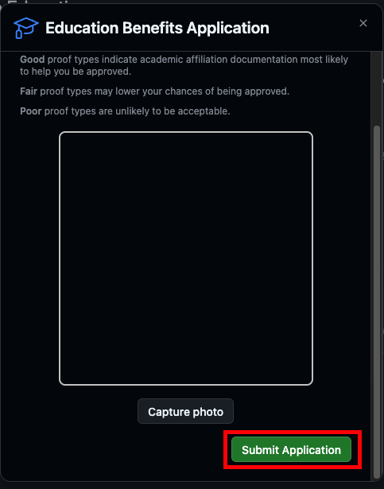

## GitHub Education Igénylése

> FONTOS: Olyan eszközt használj, amivel tudsz fotókat készíteni.

Az alábbi lépéseken végighaladva igényelheted a GitHub Student Developer Packet.

### 1. Jelentkezz be a GitHubra

1. Nyisd meg a https://github.com oldalt.
2. Jelentkezz be a GitHub fiókodba, vagy regisztrálj, ha még nincs.
3. Bejelentkezés után kattints a profilképedre a jobb felső sarokban.

### 2. Beállítások és számlázás megnyitása

1. A lenyíló menüben kattints a **Settings** menüpontra.

2. A bal oldali sávban kattints a **Billing and licensing** részre.

### 3. Fizetési adatok hozzáadása

1. Válaszd a **Payment information** menüpontot.
2. Töltsd ki a mezőket valós adatokkal.

3. Győződj meg róla, hogy a **Name** mezőben megadott név megegyezik a **nyilvánosan megjelenített neveddel**.

### 4. Oktatási kedvezmény igénylésének indítása

1. Nyisd meg az **Education benefits** részt.

2. Kattints a **Start an application** gombra.

### 5. Diákadatok kitöltése

1. A felugró ablakban válaszd a **Student** lehetőséget.
2. A **School** mezőbe írd be, hogy **Hack Club**.
3. Győződj meg róla, hogy az email cím megegyezik a **HC auth** fiókodhoz tartozó email címmel.
	- Alapértelmezetten ez az az email, amivel a GitHub fiókodat létrehoztad.
	- Szükség esetén hozzáadhatsz másodlagos email címet is.

Ezután kattints a **Share location** gombra, majd a **Continue** gombra.

### 6. Igazolás típusának kiválasztása

1. A következő oldalon kattints a **Select** gombra a hallgatói jogviszony igazolása alatt.

2. A legördülő menüből válaszd ki, milyen igazolást szeretnél használni.

> Tipp: A diákigazolvány a legjobb választás. Nekem az is működött, hogy a Hack Club Slackről készítettem képernyőképet (ehhez a listában az **Other** lehetőséget választottam).

3. Készítsd el a fényképet / képernyőképet, majd erősítsd meg a feltöltést.

### 7. Jelentkezés elküldése

Végül kattints a **Submit application** gombra.

Készen vagy! Most már csak meg kell várnod, hogy a GitHub elbírálja és jóváhagyja a Student Developer Pack jelentkezésed.
